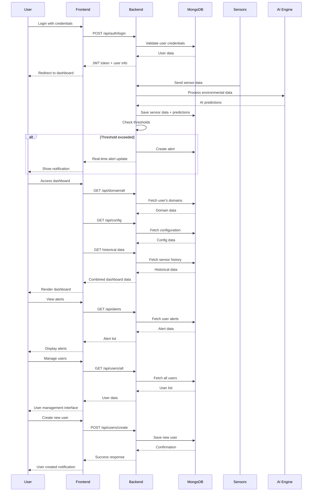
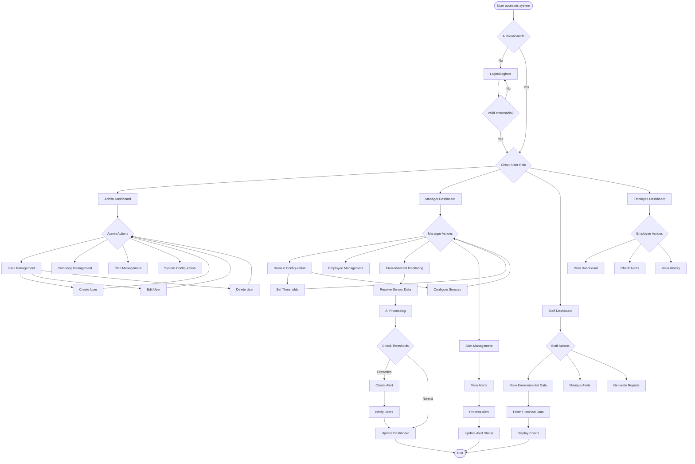
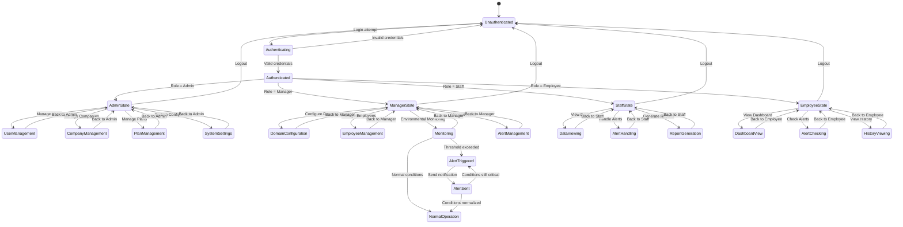
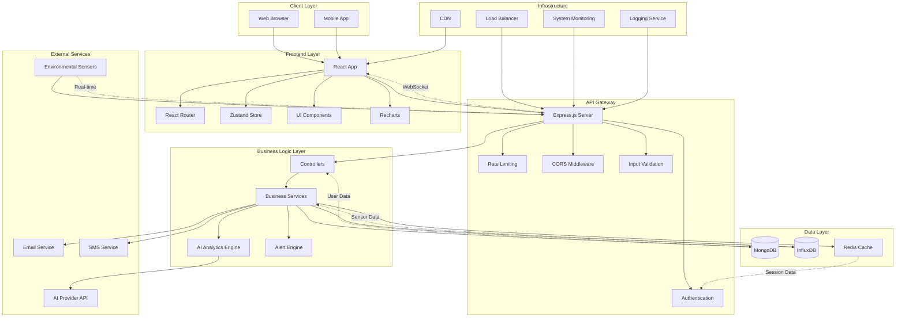

# EnvoInsight AI - Mermaid Diagrams

This document contains comprehensive Mermaid diagrams for the EnvoInsight AI environmental monitoring platform.

## 1. Use Case Diagram

```mermaid
graph TB
    subgraph "EnvoInsight AI System"
        subgraph "Actors"
            Admin[Admin User]
            Manager[Manager User]
            Staff[Staff User]
            Employee[Employee User]
            Sensor[Environmental Sensors]
            AI[AI Analytics Engine]
        end

        subgraph "Core Use Cases"
            UC1[User Authentication]
            UC2[Environmental Monitoring]
            UC3[Alert Management]
            UC4[Data Analytics]
            UC5[User Management]
            UC6[Company Management]
            UC7[Domain Configuration]
            UC8[Plan Management]
            UC9[Historical Data Access]
            UC10[AI Predictions]
            UC11[Threshold Configuration]
            UC12[Real-time Dashboard]
        end

        subgraph "Extended Use Cases"
            UC13[Data Export]
            UC14[Report Generation]
            UC15[System Configuration]
            UC16[Backup & Recovery]
        end
    end

    %% Admin relationships
    Admin --> UC1
    Admin --> UC5
    Admin --> UC6
    Admin --> UC8
    Admin --> UC15
    Admin --> UC16

    %% Manager relationships
    Manager --> UC1
    Manager --> UC2
    Manager --> UC3
    Manager --> UC4
    Manager --> UC5
    Manager --> UC7
    Manager --> UC9
    Manager --> UC11
    Manager --> UC12
    Manager --> UC13
    Manager --> UC14

    %% Staff relationships
    Staff --> UC1
    Staff --> UC2
    Staff --> UC3
    Staff --> UC4
    Staff --> UC9
    Staff --> UC11
    Staff --> UC12
    Staff --> UC13

    %% Employee relationships
    Employee --> UC1
    Employee --> UC2
    Employee --> UC3
    Employee --> UC9
    Employee --> UC12

    %% System relationships
    Sensor --> UC2
    AI --> UC4
    AI --> UC10

    %% Include relationships
    UC2 ..> UC3 : <<include>>
    UC4 ..> UC10 : <<include>>
    UC6 ..> UC7 : <<include>>
    UC6 ..> UC8 : <<include>>

    %% Extend relationships
    UC2 ..> UC11 : <<extend>>
    UC3 ..> UC14 : <<extend>>
    UC4 ..> UC13 : <<extend>>
```

## 2. Class Diagram

```mermaid
classDiagram
    class User {
        +String _id
        +String email
        +String password
        +String role
        +String firstName
        +String lastName
        +String companyId
        +Date createdAt
        +authenticate()
        +updateProfile()
        +changePassword()
    }

    class Company {
        +String _id
        +String companyName
        +ObjectId manager
        +Array employees
        +Array domains
        +ObjectId plan
        +Date createdAt
        +addEmployee()
        +removeEmployee()
        +addDomain()
        +removeDomain()
        +updatePlan()
    }

    class Domain {
        +String _id
        +String name
        +String description
        +String place
        +Object config
        +configureThresholds()
        +updateSettings()
    }

    class Plan {
        +String _id
        +String name
        +Number price
        +String currency
        +String period
        +String description
        +Array features
        +Object limits
        +Boolean isPopular
        +Boolean isActive
        +Date createdAt
        +Date updatedAt
        +activate()
        +deactivate()
    }

    class Alert {
        +String _id
        +ObjectId sensorDataId
        +ObjectId userId
        +String message
        +Date sentAt
        +sendNotification()
        +markAsRead()
    }

    class History {
        +String _id
        +ObjectId userId
        +String deviceId
        +Date timestamp
        +Number temperature
        +Number humidity
        +String domain
        +Object aiPrediction
        +String source
        +saveRecord()
        +getAnalytics()
    }

    class Config {
        +String _id
        +String name
        +Object settings
        +Date updatedAt
        +updateSettings()
        +getConfiguration()
    }

    class SensorData {
        +String _id
        +String deviceId
        +String domainId
        +Number temperature
        +Number humidity
        +Date timestamp
        +String source
        +processData()
        +validateReadings()
    }

    %% Relationships
    User ||--o{ Company : manages
    User ||--o{ Company : works_for
    Company ||--o{ Domain : contains
    Company ||--|| Plan : subscribes_to
    User ||--o{ Alert : receives
    User ||--o{ History : generates
    Domain ||--o{ SensorData : monitors
    SensorData ||--o{ Alert : triggers
    Config ||--o{ Domain : configures
    History ||--o{ SensorData : records
```

## 3. Sequence Diagram



## 4. Activity Diagram



## 5. State Diagram



## 6. System Architecture Diagram



## Diagram Descriptions

### 1. Use Case Diagram

Shows the different actors (Admin, Manager, Staff, Employee) and their interactions with the system's core functionalities including environmental monitoring, alert management, user management, and data analytics.

### 2. Class Diagram

Represents the data model showing entities like User, Company, Domain, Plan, Alert, History, Config, and SensorData with their attributes, methods, and relationships.

### 3. Sequence Diagram

Illustrates the interaction flow between system components for key operations like user authentication, environmental monitoring, dashboard data loading, and alert management.

### 4. Activity Diagram

Shows the workflow and decision points for different user roles and system processes, including the environmental monitoring flow and alert generation process.

### 5. State Diagram

Represents the different states the system can be in based on user roles and environmental conditions, showing transitions between states.

### 6. System Architecture Diagram

Provides a comprehensive view of the system's layered architecture, including client layer, frontend, API gateway, business logic, data layer, external services, and infrastructure components.

These diagrams provide a complete visual representation of the EnvoInsight AI system's structure, behavior, and interactions.
